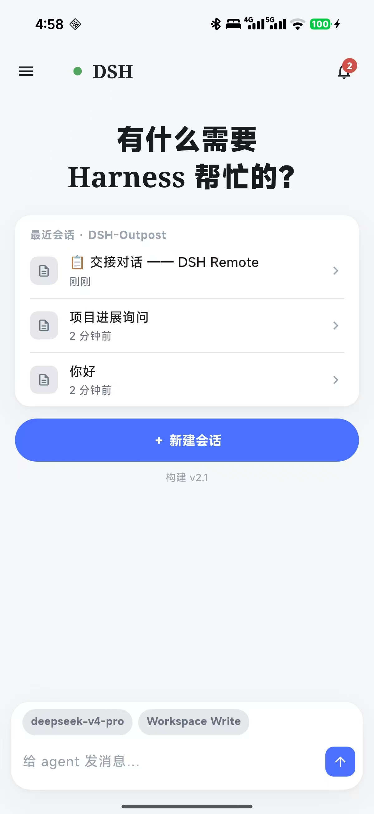
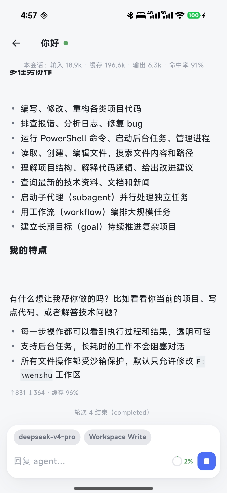
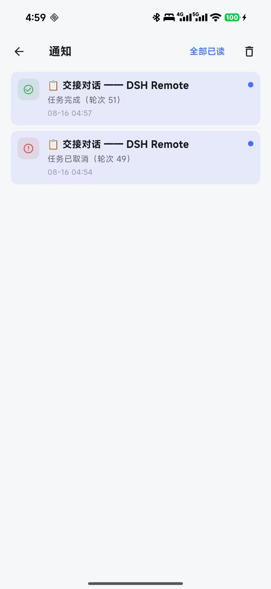
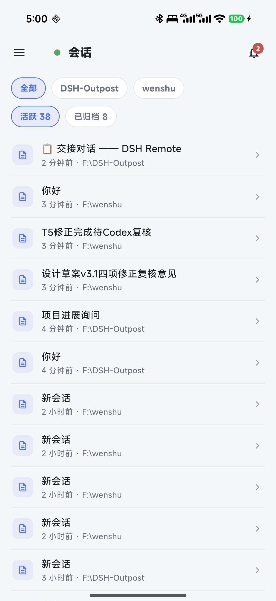
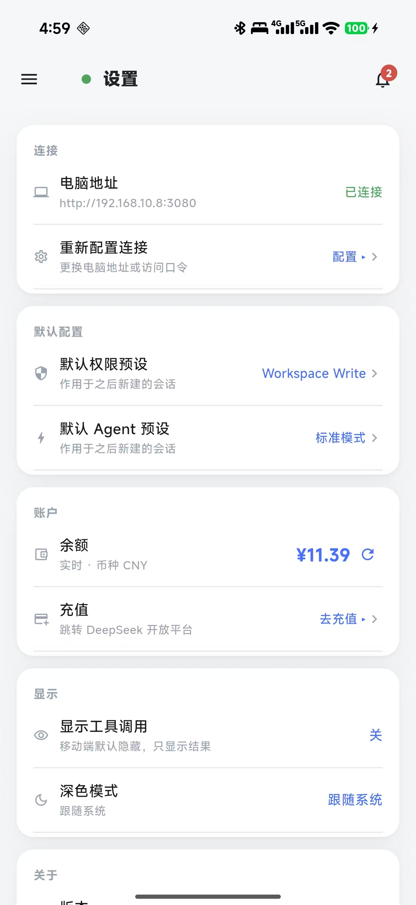
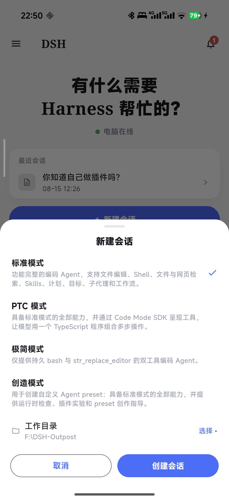

# DSH Remote（dsh-mobile-remote）

> 把 DeepSeek Harness 变成随身控制台：**手机远程操作电脑上的 agent** —— 发消息派活、看进度、收通知、审批决策、管理会话。电脑端跑着，人不在电脑前也能全程操作。

## 截图

| 首页 | 对话 | 通知 |
|---|---|---|
|  |  |  |

| 会话列表 | 设置 | 新建会话 |
|---|---|---|
|  |  |  |

## 功能

- 📱 **手机远程操作**：发消息/派任务、流式回复、Markdown 渲染、token 用量、**微信式无限上翻**（滑到顶部自动加载更早 + 回到底部浮钮）
- ❓ **问询/审批弹窗**：agent 思考中途要你拍板（选选项/输入自定义答案）或工具要权限（允许一次/拒绝）时，手机弹卡片——与 PC 端同一待办，任一端回答两端同步消失
- 🔔 **系统通知**：agent 完成 / 需要你回答 / 失败 → 手机弹窗（Server酱 / ntfy / Bark 任选；同会话同类型自动聚合）；通知页支持**单删/批量/清空**
- 💬 **会话管理**：查看/切换/续接全部会话，标题与 PC 端实时同步，按工作区分组（子目录自动归属最近工作区），归档与 PC 端同源
- ➕ **新建会话**：选 Agent 模式（标准/PTC/极简/创造）+ 选工作目录（跨盘浏览、可新建文件夹）
- ⚙️ **配置对齐 PC 端**：模型、推理强度、权限预设（危险权限需风险确认）、**默认 Agent 预设 / 默认权限预设可直接修改**（作用于之后新建的会话）
- 📶 **扫码连接**：桌面 dsh 设置页出现「连接移动端设备」二维码 → 手机 App 扫码即连（免输 IP/口令）
- 🩺 **环境诊断**：一键查看当前环境各项能力（含问询/审批桥状态），升级/排障一目了然
- 🧩 **插件动作区**：第三方插件注册的动作自动出现在移动端（可选）
- 🖼️ **原生 App**：`dsh-mobile-app/` 子目录，Flutter 原生实现，与网页端共享同一 API 与设计

## 两种使用形态

| 形态 | 说明 |
|---|---|
| **原生 App（安卓，推荐）** | `dsh-mobile-app/` 构建 APK 安装；扫码连接、原生体验、系统通知 |

## 架构

```
手机（原生 App） ──HTTP/SSE──► 电脑上的 dsh 进程（本插件）
                                  │ ctx 服务（agents/sessions/llm/…）
                                  │ /api 桥（与 PC 端 GUI 同一协议）
                                  ▼
                             dsh 内核（会话唯一真源）
```

- **会话唯一真源在 PC 端**：移动端不存状态，实时读写——天然一致，不存在"同步"
- **移动端零插件感知**：核心功能只依赖 dsh 内核语义；个性化（模型/权限/预设）全部动态读取
- **桌面端/命令行双形态兼容**：同一 profile，插件自动加载

## 安装（部署者 3 步）

### 方式一：命令行 dsh web

```powershell
# 1. 在 profile 声明插件
# 编辑 C:\Users\<你>\.dsh\profiles\web\package.json，dependencies 加：
#   "dsh-mobile-remote": "file:<本插件路径>"

# 2. 安装依赖
cd C:\Users\<你>\.dsh\profiles\web
corepack pnpm install

# 3. 启用插件（cordis.patch.yml，见下方配置节）后启动
npx @deepseek-ai/dsh web
```

### 方式二：DeepSeek Harness 桌面端

安装插件后重启桌面端即可（同一 profile，自动加载）。

### 固定端口（推荐）

```yaml
# cordis.patch.yml
- id: webserver
  config:
    host: 0.0.0.0
    port: 3080
```

## 配置（cordis.patch.yml）

```yaml
- insert:
    - id: mobile-remote
      name: dsh-mobile-remote
      config:
        path: /m
        authToken: <访问口令，留空=关闭认证>
        pushUrls: []   # 见下方推送配置
        # trustedHosts: ["<内网穿透中继地址>"]  # 仅 frp 等中继方案需要，见 docs/06 §5B
```

## 桌面设置页入口（客户端模块）

插件启用后，dsh 设置页会出现**「连接移动端设备」**一页：显示连接二维码（含地址+口令）、电脑地址列表与口令（可复制）。手机 App 扫此二维码自动连接。该页数据仅电脑本机可读取（`/m/api/qr-config` 仅允许 loopback 访问）。

## 推送配置（可选，3 分钟）

> 不配置则无系统推送，其余功能不受影响。三种任选，也可同时配置多个（事件会推送到全部通道）。同会话同类型 60 秒内合并（`pushCooldownMs` 可调），通知中心按会话聚合。

### Server酱（微信推送，最省事）

1. 手机微信扫码打开 https://sct.ftqq.com → 获取 SendKey
2. 配置：

```yaml
pushUrls:
  - name: 微信
    url: https://sctapi.ftqq.com/<SendKey>.send
    format: serverchan
```

### ntfy（安卓系统通知栏，原生弹窗）

1. 手机安装 ntfy App（Google Play / F-Droid / 酷安）
2. 生成随机主题并订阅：`dsh-<随机串>`（例如 `dsh-a1b2c3d4e5f6`）
3. 配置：

```yaml
pushUrls:
  - name: 系统通知
    url: https://ntfy.sh/<你的主题>
    format: ntfy
```

### Bark（iPhone）

1. iPhone 安装 Bark App → 复制推送 key
2. 配置：

```yaml
pushUrls:
  - name: Bark
    url: https://api.day.app/<你的key>
    format: bark
```

### 验证

配置后重启，让 agent 跑一个任务——手机收到"✅ 任务完成"通知即成功。

## 手机使用

1. 与电脑同一 WiFi；**人不在家**用蒲公英组网等虚拟组网方案（已实测，见 docs/06 §5，App 自动切换地址）
2. 打开 App →「扫码连接」对准桌面 dsh 设置页二维码（或手动输地址+口令）
3. 首页直接发消息派活；对话页实时流式回复；通知页看完成/提问/失败

## ⚠️ 注意事项

**安全**
- 访问口令（`authToken`）是唯一凭据：**每台电脑用不同口令**，扫码二维码含口令，请勿截屏转发；怀疑泄露立即更换（改配置重启后二维码自动更新，旧码作废）。
- 仅限局域网/可信内网使用；**禁止将 3080 端口映射/穿透到公网**（详见 docs/04-security.md）。
- `/m/api/qr-config`（桌面二维码数据）仅允许电脑本机读取。

**使用**
- 会话数据实时存于 PC 端；删除插件/断网不影响已存会话，重装后自动恢复。
- agent 处理上一轮时继续发消息会**排队**（dsh 机制），移动端会提示"正在处理上一轮"。
- 新建会话选的工作目录不在任何已注册工作区时，PC 端按"未分组"显示；在工作区子目录下会自动归属。

**已知限制**
- 移动端默认隐藏工具调用过程（设置可开）。
- 长任务期间建议等待上一轮完成再发新消息，避免排队混乱。
- 归档（archive）会话与 PC 端同源显示，行为一致。
- 问询/审批弹窗依赖内核 `apiProxy` 私有协议（与 PC 端 GUI 同一通道）：Harness 未来大版本重构时桥会干净降级，随插件更新恢复（诊断页可查）。
- 通知删除只清记录不"静音"：同会话同类新事件仍会产生新通知。
- App 构建签名：正式分发须自建 keystore（换签名 = 换应用，用户需重装重扫）；详见 docs/06 §8.2 与 docs/09 §6。

## 环境诊断

设置页 → 环境诊断：检测服务（agents/sessions/llm/权限/预设/工作区）与端点实测，`✅/❌` 一目了然，含检测时间。**升级 dsh 后先跑一次诊断**，红了就是需要适配的地方。

## 兼容性

- **dsh 版本**：锁定 `0.1.0-rc.6` 服务包 + 2026-08 桌面发行版验证；服务依赖、降级行为、已知问题详见 **[docs/09-compatibility.md](docs/09-compatibility.md)**
- **平台（App）**：Android 7.0+ 全品牌（渲染 Impeller 自动回退；实测小米 17 Pro Max）；**iOS 未开发**（Dart 代码已平台无关，见 docs/09 §4）
- **平台（桌面）**：Windows/macOS；命令行 dsh web 与桌面端均支持（纯 headless 形态插件静默无操作）
- **个性化**：模型/权限/Agent 预设动态读取 PC 端真实目录，用户自定义自动出现；自定义动作经 `mobileActions` 注册自动上架
- **深度魔改 web profile**（禁用标准服务）：对应功能自动降级，不崩溃——诊断页可查每个服务状态

## 文档

- `README.md` — 项目总览：功能、安装、配置、注意事项
- `FAQ.md` — 常见问题速查（连接/使用/安全/弹窗/设备）
- `CHANGELOG.md` — 版本历史
- `CONTRIBUTING.md` — 贡献指南
- `docs/00-开发总纲.md` — 产品规划、阶段划分、决策记录
- `docs/01-PRD.md` ~ `docs/07-user-manual.md` — 需求/架构/API/安全/测试/部署/手册
- `docs/08-扩展开发指南.md` — **二次开发：动作区、自定义推送、页面/App 定制、分享你的版本**
- `docs/09-compatibility.md` — **兼容性：内核耦合点、降级行为、多品牌/苹果端、已知问题、签名**

## 开发

```
lib/index.js    服务端：路由、认证、事件桥、catalog、会话、通知、动作、推送、默认配置
lib/client.js   桌面 GUI 客户端模块（设置页「连接移动端设备」）
dsh-mobile-app/ Flutter 原生 App（扫码连接 + 全部移动界面）
tools/          验证脚本（e2e-check / phase1-check / push-test）
prototype/      界面原型（v7 定稿，设计参考）
```

## 许可

[MIT](LICENSE)
