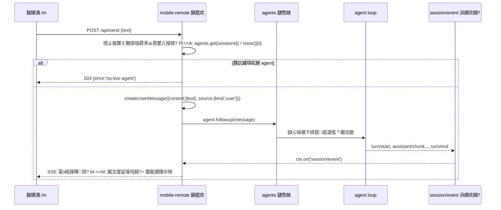
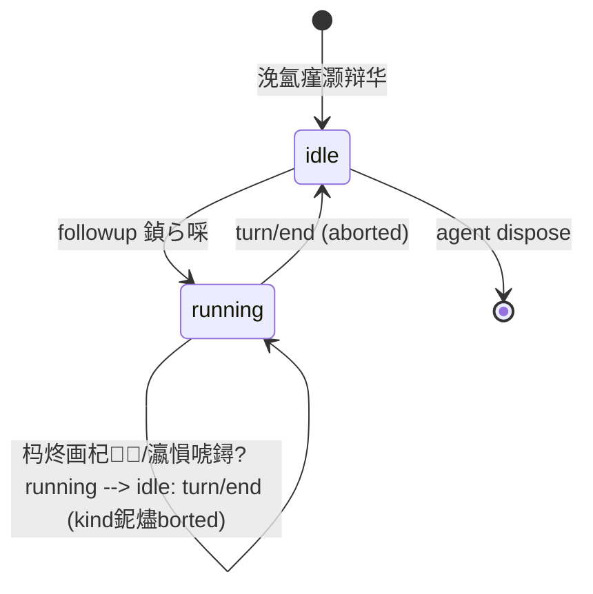
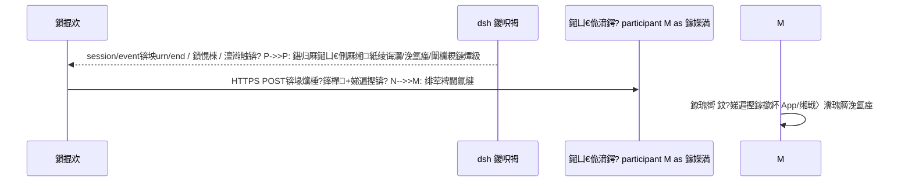

# 02 绯荤粺鏋舵瀯璁捐璇存槑涔?鈥?dsh-mobile-remote

> 鐗堟湰锛歷0.1锛堣崏妗堬級 路 鐘舵€侊細璁捐闃舵 路 閰嶅锛?1-PRD.md銆?3-api.md銆?4-security.md

## 1. 鑳屾櫙涓庤寖鍥?
dsh web 鏄?Cordis 缁勫悎鍑虹殑娴忚鍣?GUI锛坄dsh --profile web`锛夛紝webserver 榛樿鍙粦瀹?`127.0.0.1`銆傛湰鎻掍欢鍦?**web profile 鐨勫涓讳晶**鎸傝浇涓€涓?Cordis 鎻掍欢锛屽湪鐜版湁 webserver 涓婃敞鍐?`/m` 鍓嶇紑璺敱锛屾彁渚涗竴涓?*闆舵瀯寤虹殑鍘熺敓绉诲姩缃戦〉**锛岄€氳繃 dsh 鐨?agent/session 鏈嶅姟鎶婃墜鏈烘搷浣滄帴鍒拌繍琛屼腑鐨?agent 涓娿€傛彃浠朵笉淇敼妗岄潰 GUI 鐨勪换浣曠幇鏈?UI銆?
## 2. 鎶€鏈€夊瀷缁撹涓庣悊鐢?
### 2.1 绉诲姩绔舰鎬侊細鐙珛杞婚噺椤碉紙`/m`锛?vs 妗岄潰 GUI 绐勫睆閫傞厤

| 鏂规 | 浼樼偣 | 缂虹偣 | 缁撹 |
|---|---|---|---|
| 妗岄潰 GUI 绐勫睆閫傞厤锛坈lient 鎻掍欢 + slot锛?| 澶嶇敤鐜版湁 React 缁勪欢銆佽嚜鍔ㄨ幏寰楀叏閮ㄥ姛鑳?| 涓夋爮 AppFrame 閫傞厤宸ヤ綔閲忓ぇ锛汬MR 渚濊禆 `pnpm run dev:web` watcher锛涜Е鎺т綋楠岄毦鍋氶€?| 鏀惧純 |
| **鐙珛杞婚噺椤?`/m`锛堟湰鏂规锛?* | 绾?500 琛屽師鐢?HTML/CSS/JS 瑕嗙洊鍏ㄩ儴闇€姹傦紱鏃犳瀯寤猴紱涓庢闈?UI 闆惰€﹀悎锛涘彲鐙珛鎺у埗瀹夊叏杈圭晫 | 鍔熻兘闇€鑷繁瀹炵幇锛堟秷鎭祦銆侀€氱煡銆佸巻鍙诧級 | **閲囩敤** |

### 2.2 澶栧嚭閫氳矾锛歍ailscale vs cloudflared vs 瑁稿叕缃?
| 鏂规 | 璁よ瘉/TLS | 鎴愭湰 | 缁撹 |
|---|---|---|---|
| **Tailscale锛圵ireGuard 缁勭綉锛?* | 璁惧韬唤璁よ瘉 + 绔埌绔姞瀵嗭紝闆跺簲鐢ㄥ眰浠ｇ爜 | 鍏嶈垂涓汉鐗?| **閲囩敤**锛堢敤鎴峰凡纭锛?|
| cloudflared 闅ч亾 | TLS 鑷姩锛屼絾鍏綉鍙揪闇€鑷缓璁よ瘉 | 鍏嶈垂锛岄渶棰濆 token 鏈哄埗 | 澶囬€?|
| 瑁稿叕缃戞毚闇?0.0.0.0 | 鏃?| 楂樺嵄锛坅gent 鍙墽琛?bash/pwsh 鈮?RCE锛?| 鏄庣‘绂佹 |

### 2.3 鍓嶇鎶€鏈細鍘熺敓 JS vs 妗嗘灦

鍗曢〉鏃犳瀯寤恒€佹棤璺敱銆佹棤鐘舵€佺鐞嗛渶姹?鈫?鍘熺敓 HTML/CSS/JS锛圗S2022锛夛紝`EventSource` 鎺?SSE銆乣fetch` 鎺?JSON API銆乣Notification` 鍋氭彁閱掋€傞伩鍏嶅紩鍏?Node 渚ф瀯寤洪摼銆?
### 2.4 浜岀淮鐮佺敓鎴愶細npm `qrcode` 鍖咃紙Node 渚э級

Node 渚х洿鎺ョ敓鎴?PNG data 杈撳嚭缁?``锛屽墠绔浂渚濊禆锛涢伩鍏嶅湪鍓嶇鍐呰仈 QR 缂栫爜绠楁硶锛圧eed-Solomon 瀹炵幇閲忓ぇ锛夈€?
### 2.5 鍏朵綑渚濊禆

- `@deepseek-ai/schemastery`锛圕onfig schema锛屼笌 dsh 鍚屾锛?- `@deepseek-ai/dsh-llm`锛坄createUserMessage` 鏋勯€犳秷鎭級
- 瀹夸富鏈烘湇鍔★細`webServer`锛堣矾鐢憋級銆乣agents`锛圓gentRegistry锛屾儼鎬?`ctx.get`锛夈€乣sessions`锛圫essionStore锛屾儼鎬?`ctx.get`锛?
## 3. 鏋舵瀯鍒嗗眰

```mermaid
graph TB
    subgraph 鎵嬫満绔?        M[绉诲姩娴忚鍣?/m]
    end
    subgraph 鐢佃剳绔?dsh web 杩涚▼
        subgraph Cordis 缁勫悎鏍?            WS[webserver 鏈嶅姟<br/>node:http]
            PL[dsh-mobile-remote 鎻掍欢]
            AG[agents 鏈嶅姟<br/>AgentRegistry]
            SS[sessions 鏈嶅姟<br/>SessionStore]
            AL[agent loop<br/>杩愯涓殑 agent]
        end
        PL -->|register 鍓嶇紑璺敱 /m| WS
        PL -->|ctx.get 鎯版€ AG
        PL -->|ctx.get 鎯版€ SS
        PL -->|ctx.on session/event| AL
        AG -->|followup/inbox/status| AL
    end
    M -->|HTTP/SSE| WS
```

- **鎻掍欢灞?*锛堟湰鎻掍欢锛夛細璺敱娉ㄥ唽銆丣SON API銆丼SE 浜嬩欢妗ャ€佽璇併€佷簩缁寸爜銆侀潤鎬侀〉鏈嶅姟銆?- **鏈嶅姟灞?*锛坉sh 鐜版湁锛夛細`agents`锛堟敞鍏ユ秷鎭€佹煡鐘舵€侊級銆乣sessions`锛堝垪浼氳瘽銆佽浜嬩欢鍘嗗彶锛夈€乣webServer`锛堜紶杈擄級銆?- **鎵ц灞?*锛歛gent loop 娑堣垂 inbox 娑堟伅锛屼骇鍑?`session/event` 浜嬪疄娴併€?
## 4. 妯″潡鍒掑垎

### 4.1 鏈嶅姟绔紙`lib/index.js`锛?
| 妯″潡 | 鑱岃矗 |
|---|---|
| 璺敱娉ㄥ唽 | `webServer.register`锛氬墠缂€ `/m/api/*`銆乣/m/qr.png`锛沝ispose 鏃跺叏閮ㄦ敞閿€ |
| JSON API | bootstrap / send / sessions / history / catalog / notifications / defaults 鈥︼紙瑙?03-api.md锛?|
| SSE 浜嬩欢妗?| `ctx.on('session/event', ...)` 鈫?鎽樿鍖?鈫?骞挎挱鍒扮Щ鍔ㄧ杩炴帴锛涘績璺虫敞閲婂抚锛涜繛鎺ユ暟涓婇檺 |
| 璁よ瘉 | 鍙ｄ护姣斿锛堝父閲忔椂闂达紝`X-Mobile-Token` 澶达級銆?01 璇箟 |
| 浜岀淮鐮?| `qrcode` 鐢熸垚 PNG锛堟闈㈣缃〉鎵爜鐢級 |
| 鍦板潃鍙戠幇 | `os.networkInterfaces()` 鏋氫妇 IPv4锛堝惈 Tailscale 100.x 娈碉紝杩囨护铏氭嫙缃戝崱锛夛紝port 鍙栬嚜 `ctx.webServer.port` |

### 4.2 瀹㈡埛绔紙`dsh-mobile-app` Flutter + `lib/client.js` 妗岄潰妯″潡锛?
| 妯″潡 | 鑱岃矗 |
|---|---|
| App 鐘舵€佸眰锛坄store.dart`锛?| bootstrap 缂撳瓨銆佸綋鍓嶄細璇濄€丼SE 閲嶈繛锛堟寚鏁伴€€閬匡級銆佷簨浠跺幓閲嶏紙messageId/seq锛?|
| App 娑堟伅娴侊紙`chat_screen.dart`锛?| user/assistant 姘旀场銆佹祦寮忓悎骞讹紙鑺傛祦锛夈€丮arkdown 娓叉煋銆佸伐鍏锋姌鍙犮€佽疆娆″垎闅?|
| App 閫氱煡椤?| turn/end 鍒嗙被閫氱煡锛堝畬鎴?澶辫触/闇€鍥炵瓟锛夈€佸凡璇绘寔涔呭寲銆佹湭璇昏鏍?|
| App 浼氳瘽/鏂板缓 | 浼氳瘽鍒楄〃銆佹柊寤轰細璇濓紙妯″紡 + 鐩綍璺ㄧ洏娴忚锛?|
| App 璁剧疆 | 浣欓銆侀粯璁ら璁俱€佹繁鑹叉ā寮忋€佽瘖鏂€侀噸鏂伴厤缃?|
| 妗岄潰瀹㈡埛绔ā鍧楋紙`client.js`锛?| dsh 璁剧疆椤点€岃繛鎺ョЩ鍔ㄧ璁惧銆嶏細鎷?`/m/api/qr-config` 灞曠ず浜岀淮鐮?|

## 5. 鏍稿績鏃跺簭

### 5.1 鍙戞秷鎭叏閾捐矾



### 5.2 浜嬩欢鎽樿瑙勫垯锛堟湇鍔＄锛岄槻姝㈢Щ鍔ㄧ娴侀噺鑶ㄨ儉锛?
| 浜嬩欢绫诲瀷 | 涓嬪彂缁欑Щ鍔ㄧ鐨勮浇鑽?|
|---|---|
| `user/message` | 鍏ㄩ儴 text blocks锛堚墹2000 瀛楃锛?|
| `assistant/message` | 鍏ㄩ儴 text blocks锛堚墹20000 瀛楃锛夛紝reasoning 鎶樺彔璁℃暟 |
| `assistant/chunk` | 浠?text delta锛堚墹4000 瀛楃缂撳啿鍚堝苟锛?|
| `tool/result` | 宸ュ叿鍚?+ 鎴愬姛/澶辫触 + 鎴柇鍐呭锛堚墹2000 瀛楃锛?|
| `turn/start` / `turn/end` | 绫诲瀷 + 杞鍙?/ 缁撴潫鍘熷洜 |
| 鍏朵粬 | 浠呯被鍨嬪悕锛堝彲蹇界暐浜嬩欢涓嶆帹閫侊級 |

## 6. 鐘舵€佽瑙?


- 绉诲姩椤甸《閮ㄧ姸鎬佺偣鐩存帴鏉ヨ嚜鏈€杩戠殑 `turn/start`/`turn/end` 浜嬩欢鎺ㄦ柇锛沗bootstrap`/`agents` 鎺ュ彛鎻愪緵鏉冨▉鍊笺€?- "瀹屾垚閫氱煡"瑙﹀彂鏉′欢锛歚running 鈫?idle` 涓旈〉闈㈡枃妗ｅ浜?hidden 鐘舵€併€?
## 7. 鍏抽敭璁捐鍐崇瓥锛圓DR 绠€琛級

| # | 鍐崇瓥 | 鐞嗙敱 |
|---|---|---|
| D1 | 缁戝畾 `0.0.0.0` 璧?profile patch 閰嶇疆鑰岄潪 CLI | CLI 鏈夋剰鎷掔粷 `--host 0.0.0.0`锛沺atch 鏄畼鏂归厤缃眰锛孴ailscale/LAN 鍙岄€氬繀椤?|
| D2 | 鍙ｄ护璁よ瘉榛樿鍏抽棴 | 淇′换缃戠粶灞傦紙鑷 WiFi + Tailscale锛夛紱鍙ｄ护鏄彲閫夊姞鍥鸿€岄潪榛樿鎽╂摝 |
| D3 | SSE 鑰岄潪杞 | 鐜版湁 `/plugins/events` 鍚屾妯″紡锛涗簨浠跺欢杩?<500ms 闇€姹?|
| D4 | 绉诲姩椤典笉鍙戣捣鏂颁細璇?| 浼氳瘽鍒涘缓/妯″瀷閰嶇疆璇箟澶嶆潅锛坧reset銆佹ā鍨嬮€夋嫨锛夛紝v1 鍙画鎺?|
| D5 | 鎽樿涓嬫斁鑰岄潪鍏ㄩ噺浜嬩欢 | 鎺у埗娴侀噺涓庢覆鏌撴垚鏈紱妗岄潰 GUI 鍏ㄩ噺鑳藉姏涓嶅彈褰卞搷 |

## 8. 闈炲姛鑳芥灦鏋?
- **杩炴帴绠＄悊**锛歋SE 杩炴帴 Set锛屼笂闄?16锛沝ispose 鏃?`res.destroy()` 鍏ㄩ儴杩炴帴銆?- **蹇冭烦**锛氭瘡 25s 鍙戦€?`: ping` 娉ㄩ噴甯э紝闃蹭腑闂翠唬鐞嗘柇杩炪€?- **浜嬩欢骞挎挱澶辫触闅旂**锛氬崟涓繛鎺ュ啓鍏ユ姏閿?鈫?鍙柇寮€璇ヨ繛鎺ワ紝涓嶅奖鍝嶅叾浠栬闃呰€呫€?- **鏃犵姸鎬?*锛氭彃浠舵棤鑷湁鎸佷箙鍖栵紱閲嶅惎 dsh 鍚庢彃浠堕殢缁勫悎鏍戦噸鏂版寕杞斤紝SSE 杩炴帴鐢卞鎴风閲嶈繛鎭㈠銆?
## 9. 椋庨櫓涓庡簲瀵?
| 椋庨櫓 | 褰卞搷 | 搴斿 |
|---|---|---|
| 0.0.0.0 鏆撮湶缁欓檶鐢熺綉缁?| 浠栦汉鍙┍鍔?agent | 04-security.md锛氬彛浠ゅ姞鍥?+ 浣跨敤鍦烘櫙绾︽潫锛堜粎鍙俊 WiFi/Tailscale锛?|
| 娴忚鍣ㄩ€氱煡琚郴缁熸嫤鎴?| 鏀朵笉鍒板畬鎴愭彁閱?| 椤甸潰鍐呮í骞呴檷绾?+ 鐢ㄦ埛鎵嬪唽璇存槑绯荤粺璁剧疆 |
| dsh 鏈嶅姟鍚嶅彉鍔紙agents/sessions 鎺ュ彛婕旇繘锛?| 鎻掍欢澶辨晥 | 鎯版€?`ctx.get` + 鏄庣‘閿欒鏂囨锛涗緷璧栧浐瀹?rc.6 鐗堟湰 |
| SSE 鍦ㄧЩ鍔ㄧ綉缁滀笅鏂繛 | 娑堟伅娴佷腑鏂?| 鎸囨暟閫€閬块噸杩?+ 閲嶈繛鍚庡巻鍙插閲忚ˉ榻?|

---

# 绗簩閮ㄥ垎锛氱Щ鍔ㄧ浜у搧鐗堟灦鏋勶紙v2.1锛岄厤濂?00-寮€鍙戞€荤翰锛?
## 10. 鎬讳綋褰㈡€?
```mermaid
graph LR
    subgraph 鎵嬫満
        A1[DSH Remote App<br/>Flutter 鍘熺敓]
    end
    subgraph 鐢佃剳 dsh 杩涚▼
        P[dsh-mobile-remote 鎻掍欢]
        D[dsh 鍐呮牳锛歛gents/sessions/llm/settings]
        G[dsh 璁剧疆椤靛鎴风妯″潡<br/>杩炴帴绉诲姩绔澶嘳
    end
    A1 -->|HTTP/SSE| P
    G -->|loopback| P
    P -->|ctx 鏈嶅姟| D
    P -.Phase 2 鎺ㄩ€佹ˉ.-> N[鎺ㄩ€佹湇鍔?Bark/Server閰盷 -.-> A1
```

- **鍗曚竴 API 闈?*锛欰pp 鍏辩敤 `/m/api/*`锛汚PI 鍏堣锛屼袱绔悗鍐欙紙鎬荤翰 搂5锛?- **App = 鍘熺敓瀹炵幇**锛欶lutter 鍏ㄩ儴鐣岄潰锛圥hase 3 瀹屾垚锛寁2.1 璧峰敮涓€绉诲姩绔舰鎬侊級
- **缃戦〉鐗堝凡绉婚櫎**锛歷2.1 璧蜂笉鍐嶆彁渚?`/m` 椤甸潰锛坄page.html` 鍒犻櫎锛夛紝鍑忓皯杩愯璧勬簮锛涙闈㈣缃〉鐢卞鎴风妯″潡鎻愪緵

## 11. 鏂板鏈嶅姟涓庢ā鍧楋紙鎻掍欢渚э級

| 妯″潡 | 鑱岃矗 | 渚濊禆 |
|---|---|---|
| `catalog` | 妯″瀷/鎺ㄧ悊/鏉冮檺/棰勮鏋氫妇鑱氬悎锛堣 PC 绔湡瀹炵洰褰曪級 | `ctx.llm`銆乸ermission-presets銆乤gent-presets manifest |
| `session-config` | 褰撳墠浼氳瘽妯″瀷/鎺ㄧ悊/鏉冮檺璇诲啓锛堝啓璧?PC 绔悓涓€浜嬩欢璺緞锛?| `agents`銆乸ermission 鏈嶅姟 |
| `session-create` | 鎸?preset 鏂板缓浼氳瘽骞惰鍐欓厤缃?| `agents.create`銆乸resets |
| `notifications` | 浜嬩欢娴佽仛鍚堬紙completed/needs-answer/failed锛? 宸茶鐘舵€侊紙settings 鍩燂級 | `ctx.on session/event`銆乣ctx.settings` |
| `mobile-actions` | 鍔ㄤ綔娉ㄥ唽琛ㄦ湇鍔?`ctx.mobileActions` + 娓呭崟/鎵ц绔偣 | 娉ㄥ唽琛紙Cordis 璇箟锛?|

## 12. 鍏抽敭瀹炵幇瑕佺偣

- **閫氱煡鑱氬悎**锛歚needs-answer` 璇箟 Phase 1 瀹炵幇鏃朵粠浜嬩欢娴侀獙璇侊紙瀹℃壒/鎻愰棶鐩稿叧浜嬩欢锛夛紱鑱氬悎涓哄唴瀛樻姇褰?+ 宸茶闆嗗悎鎸佷箙鍖栦簬 settings 鍩?- **鏉冮檺鍐欏叆**锛歚POST /api/session-config` 鐨勬潈闄愰」澶嶇敤 PC 绔?`/permission <preset>` 鐨勫啓鍏ヨ矾寰勶紙permission/preset 浜嬩欢 + sandbox/approval 鏃嬮挳锛夛紝纭繚妗岄潰 GUI 涓庣Щ鍔ㄧ鐪嬪埌鍚屼竴浜嬪疄
- **妯″瀷鍒囨崲**锛氱粡 `ctx.agents` 鐨?per-session LLM target 璁剧疆锛坄installAgentLlmTarget` 璇箟锛夛紝涓?GUI 妯″瀷閫夋嫨鍣ㄤ竴鑷?- **鍔ㄤ綔鎵ц**锛歨andler 鍦ㄧ數鑴戠杩愯锛岄暱浠诲姟缁撴灉缁忎細璇濅簨浠跺洖娴侊紙涓嶉樆濉?HTTP 鍝嶅簲锛?
## 13. 鎺ㄩ€佹ˉ锛圥hase 2 鏋舵瀯锛?


- 閰嶇疆锛歚settings` 鍩燂紙鎺ㄩ€佹湇鍔?URL銆佸瘑閽ャ€佷簨浠剁被鍨嬪紑鍏炽€侀潤榛樻椂娈碉級
- 娣遍摼锛氱綉椤电増 `.../m?session=<id>`锛汚pp 鑷畾涔?scheme锛圥hase 3 瀹氾級
- 鍘婚噸/鑺傛祦锛氬悓浼氳瘽鍚岀被鍨?60s 鍐呭悎骞?
## 14. App 鏋舵瀯锛圥hase 3 瑕佺偣锛?
- Flutter 鍗曞伐绋嬶紱鐘舵€佺鐞?Riverpod锛汼SE 鐢?`http` 鍖呮祦寮忚В鏋愶紙鎴?`web_socket_channel` 鏇夸唬閫氶亾锛?- 椤甸潰锛氶椤碉紙娆㈣繋锛? 浼氳瘽 / 瀵硅瘽 / 閫氱煡 / 璁剧疆锛堝鐓у師鍨?v7锛?- 鏈湴瀛樺偍锛氳繛鎺ラ厤缃紙鍦板潃/鍙ｄ护锛夈€乁I 鍋忓ソ锛堝伐鍏锋樉绀恒€佷富棰橈級
- 閫氱煡锛氬墠鍙?SSE 浜嬩欢 鈫?鏈湴閫氱煡锛涘悗鍙颁緷璧?Phase 2 鎺ㄩ€佹ˉ锛圓pp 涓嶄繚娲婚暱杩炴帴锛?
