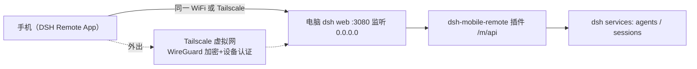

# 06 部署与启用文档 — dsh-mobile-remote

> 版本：v2.4.0 · 状态：已在本机完成安装与验证 · 配套：04-security.md、07-user-manual.md、09-compatibility.md

## 1. 部署拓扑



- 手机端：安装 DSH Remote App（构建方法见 §8），App 连接电脑地址（如 `http://192.168.1.100:3080`）。
- 桌面端入口：dsh 设置页「连接移动端设备」（插件客户端模块）显示扫码二维码与连接信息。
- 外出访问：Tailscale 组网后 App 连接 `http://<Tailscale IP>:3080`。
## 2. 安装位置说明（通用）
| 项目 | 位置 |
|---|---|
| 插件源码 | `<本仓库>/`（package.json / lib / docs / tools） |
| 已安装副本 | `~/.dsh/profiles/web/node_modules/dsh-mobile-remote/` |
| profile 依赖声明 | `~/.dsh/profiles/web/package.json` → `"dsh-mobile-remote": "file:<本仓库路径>"` |
| 启用配置 | `~/.dsh/profiles/web/cordis.patch.yml`（insert mobile-remote + webserver 0.0.0.0） |
| 访问口令 | 部署时生成（`crypto.randomBytes(24).toString('base64url')`），写入 `authToken` |

## 3. 启用/重启步骤

```powershell
# 1. 修改插件源码后，同步已安装副本（file: 依赖不会自动重装）
cd ~/.dsh/profiles/web
corepack pnpm install

# 2. 检查组合配置（不启动）
npx @deepseek-ai/dsh --profile web --dump-config
# 确认输出包含 mobile-remote 行与 webserver host: 0.0.0.0

# 3. 重启 dsh web
npx @deepseek-ai/dsh web
```

启动成功后控制台会打印：
`dsh web: http://127.0.0.1:3080 (LAN: http://192.168.x.x:3080)`

## 4. 变更配置（口令/路径/充值地址）
编辑 `cordis.patch.yml` 改 `mobile-remote` 行的 `config`，然后重启：

```yaml
- insert:
    - id: mobile-remote
      name: dsh-mobile-remote
      config:
        path: /m
        authToken: <新口令，留空=关闭认证>
        rechargeUrl: https://platform.deepseek.com/top_up
```

口令生成建议：`node -e "console.log(require('crypto').randomBytes(24).toString('base64url'))"`

## 5. 外出访问（三选一）

> 共同前提：家里电脑保持开机、dsh 运行。三者都与 App 的「多地址自动切换」兼容；方案 A 最省事，方案 B 国内最稳（需要一台有公网 IP 的 VPS），方案 C 零月费但依赖路由器。**禁止把 3080 端口直接映射/穿透到公网裸奔**。

### 5A. ZeroTier（推荐首选，类 Tailscale 但国内可用）

1. 电脑安装 [ZeroTier One](https://www.zerotier.com/download/) 并加入你的网络（网页端 zerotier.com 建网，免费）。
2. 手机安装 ZeroTier One（官网/酷安/APKMirror 均有 APK，无需 Google Play），登录同一账号加入同一网络（手机 IP 形如 `10.147.x.x`/`172.x.x.x`）。
3. **App 自动生效**：连接成功后 App 自动收集 ZeroTier 网段地址，断线自动轮换——出门自动走 ZeroTier，回家自动走局域网，无需手动配置。

### 5B. frp 内网穿透（国内最稳，需 VPS）

1. VPS（有公网 IP，轻量服务器即可）上运行 frps：
```toml
# frps.toml
bindPort = 7000
auth.token = "<frp隧道口令>"
```
2. 家里电脑运行 frpc（常驻，主动外连，无需路由器/端口映射）：
```toml
# frpc.toml
serverAddr = "<VPS公网IP>"
serverPort = 7000
auth.token = "<frp隧道口令>"

[[proxies]]
name = "dsh"
type = "tcp"          # 更安全可选 stcp（端到端加密，手机需同时跑 frpc）或 https
localIP = "127.0.0.1"
localPort = 3080
remotePort = 3080
```
3. 放行中继主机的 Host 校验（v2.4.1 起支持 `trustedHosts`）+ **必须开启强口令**：
```yaml
- insert:
    - id: mobile-remote
      name: dsh-mobile-remote
      config:
        path: /m
        authToken: <16位以上随机口令>
        trustedHosts: ["<VPS公网IP或域名>"]
```
4. 手机 App 手动输入 `http://<VPS公网IP>:3080` + 口令连接。
> ⚠ tcp 模式下「手机↔VPS」段为明文 HTTP，**口令是唯一防线，必须强随机**；追求更强安全用 stcp（端到端加密）或 https（VPS 配置证书）。

### 5C. 路由器 WireGuard（零月费）

- 路由器支持 WireGuard 服务端（OpenWrt/华硕/部分小米刷机）且家里有公网 IP（或 DDNS）：路由器开 WG → 手机装官方 WireGuard App 连回家 → 等同回到家里局域网。
- App 自动收集 WG 网段地址并切换，无需手动配置。

> App 的自动切换机制：连接成功后从 `/api/bootstrap` 收集电脑全部地址（局域网/ZeroTier/WG 网段 IP），断线重试失败自动轮换；frp 场景手动配置的 VPS 地址同样进入候选列表。设置 → 电脑地址显示「共 N 个地址自动切换」。
## 6. 推送桥配置（可选，部署者 3 分钟）
> agent 完成 / 需要你回答 / 失败 → 手机系统通知。**不配置则无推送**，其他功能不受影响。
> 电脑只需能正常上网（HTTPS 出站），无需公网端口。
在 `cordis.patch.yml` 的 `mobile-remote` 行 `config` 下加 `pushUrls`（可配多个通道，事件同时推送到全部）：

### Server酱（微信推送，安卓/全平台通用）
```yaml
- insert:
    - id: mobile-remote
      name: dsh-mobile-remote
      config:
        path: /m
        authToken: <口令>
        pushUrls:
          - name: 微信
            url: https://sctapi.ftqq.com/<你的SendKey>.send
            format: serverchan
```

SendKey 获取：手机微信扫码打开 `https://sct.ftqq.com` → 登录 → 复制 SendKey。
### ntfy（安卓系统通知栏，开源自托管友好）
```yaml
        pushUrls:
          - name: ntfy
            url: https://ntfy.sh/<你的随机topic>
            format: ntfy
```

手机装 ntfy App 订阅同一 topic。注意公共服务器 topic 可被猜测，建议用长随机串。
### Bark（iPhone）
```yaml
        pushUrls:
          - name: Bark
            url: https://api.day.app/<你的key>
            format: bark
```

### 通用 webhook

```yaml
        pushUrls:
          - name: 自建
            url: https://your-server.example.com/hook
            format: generic
```

**验证**：配置后重启桌面端，手机端让 agent 跑一个任务（或失败/提问），对应微信/App 收到通知。同会话同类型 60 秒内合并（`pushCooldownMs` 可调）。
## 7. 回滚方案

1. 从 `cordis.patch.yml` 删除 `mobile-remote` 行与 `webserver` 覆盖行（或整体还原为 `[]`）。
2. 从 `package.json` 删除 `dsh-mobile-remote` 依赖并 `corepack pnpm install`。
3. 重启 dsh web。插件路由、SSE 连接随 fiber dispose 全部释放，桌面 GUI 不受影响。
## 8. Flutter App（dsh-mobile-app，安卓）

> 源码：`dsh-mobile-app/` 子目录（独立 Flutter 工程，与插件同仓库发布）。
### 8.1 架构

App = **原生 Flutter 应用**（非 WebView）：全部界面用 Flutter 原生组件绘制，与网页端 `/m` 共享同一套插件 API 与设计令牌（DeepSeek 配色）。
- 连接：扫码连接（扫桌面 dsh 设置页「连接移动端设备」二维码）或手动输地址+口令。
- 页面：首页（欢迎 + 最近会话 + 输入框）、对话（流式回复、Markdown、token 用量、工具调用折叠）、会话列表、通知中心、设置（余额/默认预设/深色模式/环境诊断）、新建会话（模式 + 工作目录跨盘浏览）。
- 数据：与网页端相同 —— 全部实时读写 PC 端 dsh，无本地状态。
### 8.2 构建 APK

前置：Flutter SDK（本项目用 3.47.0） + Android SDK。
```powershell
cd dsh-mobile-app
flutter analyze        # 应为 No issues found
flutter build apk --release
# 产物：build\app\outputs\flutter-apk\app-release.apk
```

**Release 签名（发布前必做）**：正式分发必须用你自己的 keystore（否则用的 debug 签名，且换签名=换应用、用户需卸载重装）：

```powershell
# ① 生成 keystore（记住密码；jks 与 key.properties 均已 gitignore，勿提交、勿丢失）
keytool -genkeypair -v -keystore android/app/release.jks -keyalg RSA -keysize 2048 -validity 10950 -alias dsh

# ② 写 android/key.properties
# storePassword=<密码>
# keyPassword=<密码>
# keyAlias=dsh
# storeFile=app/release.jks

# ③ 构建（build.gradle.kts 自动读取 key.properties；不存在则回退 debug 签名）
flutter build apk --release
```

> 首次构建需下载 Gradle 依赖（约 5-10 分钟）；若报 Kotlin 增量缓存损坏（`Could not close incremental caches`），`android/gradle.properties` 已设 `kotlin.incremental=false`，删除 `build` 与 `.dart_tool` 后重试。
> 更换图标：把 1024×1024 PNG 覆盖到 `assets/icon-1024.png`，运行 `python tools/make_icon.py` 后重新构建。
> 多品牌/兼容性注意事项见 docs/09-compatibility.md。
### 8.3 安装与使用
1. 把 `app-release.apk` 传到手机（微信文件传输/网盘/USB），点击安装（需允许"安装未知来源应用"）。
2. 打开 App →「扫码连接」对准电脑屏幕上的二维码（桌面 dsh 设置 →「连接移动端设备」页）；或手动输入电脑地址 + 访问口令。
3. 连接成功进入首页，直接发消息派活。
> 说明：Android 9+ 默认禁止明文 HTTP，App 已配置 `usesCleartextTraffic`，仅限局域网/内网使用，勿暴露公网。
> 换签名安装会报「签名不一致」：先卸载旧版再装新版（连接信息需重新扫码）。
### 8.4 重建与更新
- 插件/网页端改动 → 按 §3 同步并重启 dsh web。
- App 改动 → 重新 `flutter build apk --release` 并重装（同签名覆盖安装，保留连接信息）。
## 9. 验收清单（v2.4，均已执行 ✅）

- [x] `--dump-config` 含 mobile-remote 行与 webserver 0.0.0.0
- [x] 未认证 401 / 错误口令 401 / 正确口令通行
- [x] `POST /m/api/send` 注入成功（200 + messageId）
- [x] SSE 连接 + hello + 事件转发（重连退避、断线补拉、pendingFrames 回放）
- [x] `/m/qr.png` 返回 PNG
- [x] 桌面设置页「连接移动端设备」二维码 + App 扫码自动连接
- [x] Flutter App：analyze 零问题 + 正式签名 release 构建 + 真机全流程测试
- [x] 问询弹窗端到端（手机选选项→agent 收到答案 / ✕→取消 / PC 端先答两端同步）
- [x] 权限审批弹窗端到端（允许一次→操作继续 / 拒绝→操作被拒）
- [x] 通知删除（单删/批量/清空）+ 诊断页服务探针（respondBridge/frameBridge ✅）
